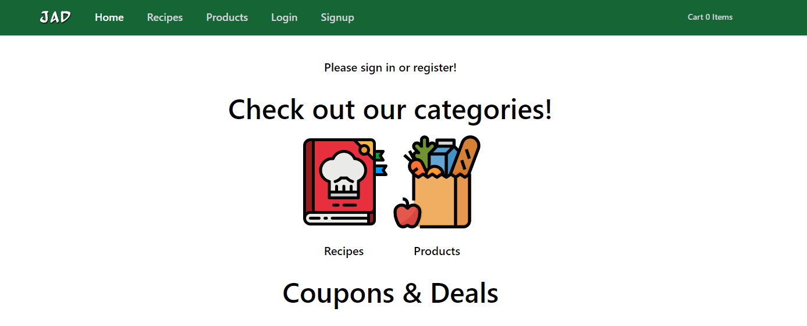
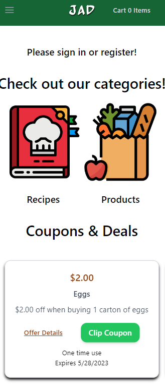
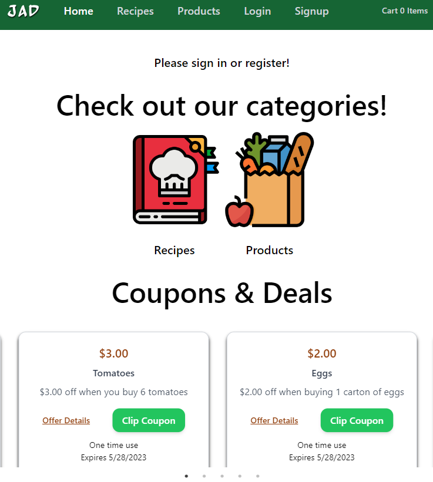

# Grocery_E-commerce

## Description

A single page Grocery website created with React, GraphQL, Node, MongoDB, Mongoose and Heroku .Users can search for recipes and find the ingredients in the database . The shopping cart allows for addition, subtraction, removal, and quantify updated. The applicatioin makes use of JSON Web Tokens (JWT), Stripe(for payment) and Heroku(for deployment).

[GitHub] <https://github.com/JoshEflin/JAD>

## Table of Content

- [Description](#description)
- [Contributions](#contributions)
- [Screenshots](#screenshots)
- [Deployment](#deployment)
- [License](#license)

## Contributions

Josh Eflin <https://github.com/JoshEflin/>
Alex Weiss <https://github.com/alexander1262>
Daniel Gardner <https://github.com/gardnerd06>

## Screenshots

## How to Contribute

If you'd like to contribute, here's how to reach us with additional questions
[Alex]<in/alexander-weiss-571356174>
[Josh]<in/josh-eflin-4378baa7>
[Daniel]<in/daniel-gardner-562020253>

## Deployment

Start shopping now at https://groceryjad.herokuapp.com/

## License

MIT License

Copyright (c) [2023] [gardnerd06]

Permission is hereby granted, free of charge, to any person obtaining a copy of this software and associated documentation files (the "Software"), to deal in the Software without restriction, including without limitation the rights to use, copy, modify, merge, publish, distribute, sublicense, and/or sell copies of the Software, and to permit persons to whom the Software is furnished to do so, subject to the following conditions:

The above copyright notice and this permission notice shall be included in all copies or substantial portions of the Software.

THE SOFTWARE IS PROVIDED "AS IS", WITHOUT WARRANTY OF ANY KIND, EXPRESS OR IMPLIED, INCLUDING BUT NOT LIMITED TO THE WARRANTIES OF MERCHANTABILITY, FITNESS FOR A PARTICULAR PURPOSE AND NONINFRINGEMENT. IN NO EVENT SHALL THE AUTHORS OR COPYRIGHT HOLDERS BE LIABLE FOR ANY CLAIM, DAMAGES OR OTHER LIABILITY, WHETHER IN AN ACTION OF CONTRACT, TORT OR OTHERWISE, ARISING FROM, OUT OF OR IN CONNECTION WITH THE SOFTWARE OR THE USE OR OTHER DEALINGS IN THE SOFTWARE.
